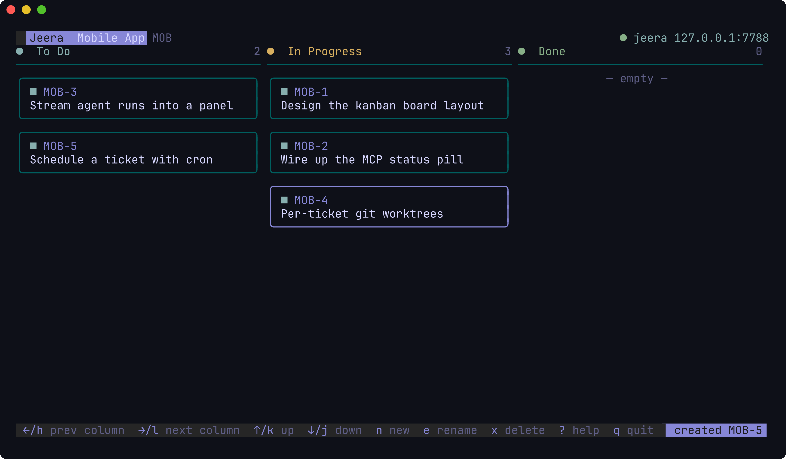

<div align="center">

# Jeera

**Agentic-first issue tracking that lives in your terminal.**

A [lazygit](https://github.com/jesseduffield/lazygit)-inspired TUI that reimagines Jira for the age of AI agents — with a built-in [MCP](https://modelcontextprotocol.io) server so your agents always know about your tickets, and a one-key **Start** that puts those agents to work on them.

[](LICENSE)
[](https://github.com/03-CiprianoG/jeera/actions/workflows/ci.yml)


</div>

> [!WARNING]
> **🚧 Built in the open.** The architecture is settled and the implementation lands incrementally via pull requests, each one tested and released under [semantic versioning](https://semver.org). The **Status** column below tracks what's usable today versus what's on the way.

## What is Jeera?

Jeera is an open-source issue tracker that runs entirely in your terminal. Take the keyboard-driven flow of `lazygit`, apply it to issues, epics, sprints and boards — then design from the first commit for a world where **AI agents are first-class operators**, not bystanders.

Jeera is **local-first** and the **system of record**: it owns your tickets in a local SQLite store on your machine. A human drives the board through a fast, calm TUI; agents drive the *same* tickets through a built-in **Model Context Protocol server**. Both read and write one source of truth, so they never drift apart — move a card in the TUI and an agent sees it; let an agent transition an issue and the board updates live.

And because Jeera knows how to talk to the AI coding CLIs already on your machine, a ticket isn't just something you track — it's something you can **run**.

## Why "agentic-first"?

Most tools bolt a chat box onto a GUI. Jeera inverts that. The agent isn't a feature *inside* the app — the app is a clean surface that agents connect to **and** a launchpad that puts agents to work:

- Run **`jeera`** and you get two things at once: a snappy terminal board for you **and** an embedded MCP server (local HTTP) running right beside it.
- Point any MCP client (Claude Code, Claude Desktop, Cursor, a cron agent…) at that server — *if and where you choose* — and it can **list, create, transition, comment on, and link issues**, instantly aware of every ticket, with no scraping and no glue code.
- Hit **Start** on a ticket and Jeera spawns a local coding agent (`claude`, `codex`) to actually *do the work* — in an isolated git worktree, pointed back at Jeera's own MCP so it updates the ticket as it goes. No API keys, no SDKs: it drives the CLIs you already have.

## Features

> Legend: ✅ available · 🔭 in progress · 🔜 planned

### Jira, reimagined for the terminal

| Feature | Status | Notes |
|---|:---:|---|
| **Projects** bound to a git repo | ✅ | Each project points at a repository (set on create); switch between many |
| **Issues** — epics, stories, tasks, bugs, subtasks | ✅ | Per-project keys (`JEE-12`), Markdown descriptions |
| **Statuses** & a configurable board | ✅ | Named columns grouped into To Do / In Progress / Done lanes |
| **Priority**, **story points**, **tags** | ✅ | Five priority levels, point estimates, project-scoped labels |
| **Sprints** | ✅ | Time-boxed, future/active/completed, backlog ↔ sprint |
| **Relationships** | ✅ | blocks / blocked-by / relates / duplicates, shown from both sides |
| **Model assignees** | ✅ | Work is assigned to a *model* — provider + model + reasoning effort |
| **Comments & activity** | ✅ | Humans and agent runs both post to the timeline |
| **Attachments** | 🔜 | Files referenced by path; capability-gated inline image preview |
| **Kanban board** (keyboard-first) | ✅ | vim-style navigation, create/rename/delete, move cards across columns, live refresh |
| **Ticket detail** view | ✅ | Markdown edit/preview, in-place editing of status/type/priority/points/assignee/sprint/epic/tags, comments |
| **Backlog · Sprints · Epics** views | 🔭 | Dedicated management screens (assignment already works from the ticket) |

### Jeera superpowers

| Feature | Status | Notes |
|---|:---:|---|
| **Embedded MCP server** | ✅ | Serves over local HTTP with `jeera` / `jeera --headless`; 15 typed tools for agents |
| **Start a ticket** | ✅ | Press `s` to spawn `claude`/`codex` on the issue; it drives the ticket over MCP, streamed into the Runs view |
| **Run versioning** | ✅ | Every Start is a new, recorded run version with its provider/model/effort, session and status |
| **Per-ticket git worktrees** | ✅ | Each run is isolated on its own branch (default on, toggle off with `w`) |
| **Model + effort picker** | ✅ | Choose the provider, model and reasoning effort per ticket from the detail view |
| **Schedule Start** | ✅ | Press `S` and enter a cron spec; Jeera runs the ticket on time, persisted across restarts and headless |
| **Start with children** | 🔜 | Resolve sub-issues in dependency order, then the parent |
| **Settings & defaults** | ✅ | Global → per-project → per-ticket cascade; `,` edits the global defaults |
| **Expand / Discuss** | 🔜 | Drop into an interactive agent session pre-loaded with the ticket |

## How it runs

**One binary, one command, one source of truth.** Running `jeera` starts the TUI and the embedded MCP server together — both backed by the same core and store, with an execution engine and scheduler that drive your local AI CLIs:

```
                  ┌──────────────────────────────────────────────┐
   You  ────────► │                    jeera                      │ ◄──── AI agents
  (keyboard)      │                                              │      (Claude Code,
                  │   ┌──────────┐              ┌─────────────┐  │       Cursor, cron…)
                  │   │   TUI    │              │     MCP     │  │   via the Model
                  │   │ Bubble   │              │   server    │  │   Context Protocol
                  │   │  Tea v2  │              │   (HTTP)    │  │
                  │   └────┬─────┘              └──────┬──────┘  │
                  │        └──────────┬────────────────┘         │
                  │              core + store                    │
                  │          (one local source of truth)         │
                  │        ┌──────────┴───────────┐              │
                  │   ┌────┴─────┐          ┌──────┴──────┐       │
                  │   │ execution│          │  scheduler  │       │
                  │   │  engine  │          │  (cron)     │       │
                  │   └────┬─────┘          └─────────────┘       │
                  └────────┼─────────────────────────────────────┘
                           ▼
                  spawns  claude / codex  in a git worktree,
                  pointed back at Jeera's own MCP server
```

| Command | Result |
|---|---|
| `jeera` | TUI **and** MCP server (default) |
| `jeera --headless` | MCP server only (no TUI) |
| `jeera --no-mcp` | TUI only (no MCP server) |
| `jeera version` | print version and exit |

## Install

> Pre-built release binaries and `go install` land with **v0.1.0**. For now, build from source.

```sh
git clone https://github.com/03-CiprianoG/jeera.git
cd jeera
go build -o jeera .     # requires Go 1.25+ ; produces a single static binary (CGO-free)
./jeera version
```

Jeera stores its data under your XDG data directory (`~/.local/share/jeera/jeera.db`) and reads configuration from `~/.config/jeera/`. Both honor `XDG_*` and the `JEERA_DATA_DIR` / `JEERA_CONFIG_DIR` overrides.

## Connecting an agent

Once the MCP server is running (shown in the TUI's status bar), point your client at it. For Claude Code:

```sh
claude mcp add --transport http jeera http://127.0.0.1:7777
```

…or drop this into `.mcp.json` (the TUI shows the live port and a copy-paste block):

```json
{
  "mcpServers": {
    "jeera": { "type": "http", "url": "http://127.0.0.1:7777" }
  }
}
```

## Configuration

Jeera resolves every run's settings through a three-layer cascade — **issue → project → global** — so you set sensible defaults once and override them only where it matters. Press `,` in the board to edit the global defaults live, or write them to `~/.config/jeera/config.toml`:

```toml
mcp_port = 7777          # preferred MCP port (JEERA_MCP_PORT still wins)

[defaults]
provider        = "claude"            # claude | codex
model           = "opus"
effort          = "medium"            # low | medium | high | xhigh | max
worktree_on     = true                # isolate each run in a git worktree
permission_mode = "bypassPermissions" # bypassPermissions | acceptEdits | plan | default
```

A project can override any default, and an individual ticket overrides the project — a model that doesn't fit the resolved provider falls back to that provider's default, so a run never starts misconfigured.

## Screenshots



*The board: status columns, model-assignee cards, and the always-on **MCP wire** (top-right) showing the live endpoint an agent can connect to. Press Enter for the ticket detail editor, `s` to start an agent on a ticket, and `R` for the live Runs view.*

## Stack

Chosen deliberately, not by default — every external API verified against current upstream releases:

| Layer | Choice | Why |
|-------|--------|-----|
| Language | **Go 1.26** | Single static binary, trivial cross-compilation, strong concurrency |
| TUI | **Bubble Tea v2** + **Lip Gloss v2** + **Bubbles v2** | The gold standard for clean terminal UIs; v2's cell renderer is built for speed |
| Markdown | **Glamour v2** | Styled rendering of ticket descriptions |
| Agents (server) | **MCP Go SDK** (official, GA) | The same binary serves agents and humans over Streamable HTTP |
| Agents (execution) | **`claude` / `codex` CLIs** | Drives the tools you already have — no API keys, no SDKs |
| Storage | **modernc.org/sqlite** (pure Go) + **goose** | Local-first system of record; keeps the binary static (no CGO) |
| Scheduling | **gocron** | In-process cron for "Schedule Start" |

## Roadmap

Released under semantic versioning; each milestone is one or more pull requests.

- [x] **Foundation** — domain model + local SQLite store
- [x] **MCP server** — 15 typed tools over the shared store
- [x] **v0.1.0** — design system + Kanban board (first runnable release)
- [x] **v0.2.0** — ticket detail view: rich-text editing + all Jira fields + comments
- [x] **v0.3.0** — execution engine: Start / worktrees / runs / versioning
- [x] **v0.4.0** — scheduling: cron a ticket to run itself, persisted and headless
- [x] **v0.5.0** — settings: global → project → ticket config cascade, project repo paths *(you are here)*
- [ ] **v1.0.0** — feature-complete, cross-platform release binaries

## Contributing

Contributions are very welcome — especially this early, while the foundations are being poured. See **[CONTRIBUTING.md](CONTRIBUTING.md)**. In short: `main` is protected, so all changes come in via pull request, must pass CI, and follow [Conventional Commits](https://www.conventionalcommits.org). See **[CHANGELOG.md](CHANGELOG.md)** for what's landed.

By participating you agree to our [Code of Conduct](CODE_OF_CONDUCT.md).

## License

[MIT](LICENSE) © 2026 Giuseppe Cipriano and the Jeera contributors.

## Acknowledgements

Standing on the shoulders of [Charm](https://charm.sh) (Bubble Tea, Lip Gloss & Glamour), the [Model Context Protocol](https://modelcontextprotocol.io), and [lazygit](https://github.com/jesseduffield/lazygit) for the inspiration.
