<div align="center">


# Jeera

**Agentic-first issue tracking that lives in your terminal.**

*`lazygit` for issue tracking — local-first, MCP-native, and built to put your AI agents to work on the tickets they read.*

[](LICENSE)
[](https://github.com/03-CiprianoG/jeera/actions/workflows/ci.yml)
[](https://github.com/03-CiprianoG/jeera/releases/latest)


<samp>
<a href="#why-jeera">Why</a> &nbsp;·&nbsp;
<a href="#how-it-works">How it works</a> &nbsp;·&nbsp;
<a href="#a-look-around">Screenshots</a> &nbsp;·&nbsp;
<a href="#features">Features</a> &nbsp;·&nbsp;
<a href="#agent-tools-mcp">MCP tools</a> &nbsp;·&nbsp;
<a href="#keybindings">Keys</a> &nbsp;·&nbsp;
<a href="#install">Install</a> &nbsp;·&nbsp;
<a href="#configuration">Config</a>
</samp>

</div>

> [!NOTE]
> **One binary.** Run `jeera` and you get a calm terminal board for **you** and an embedded **MCP server** for your **agents** — both reading and writing one local source of truth — plus a one-key **Start** that spawns a coding agent on a ticket. No account, no cloud, no telemetry.

<div align="center">
  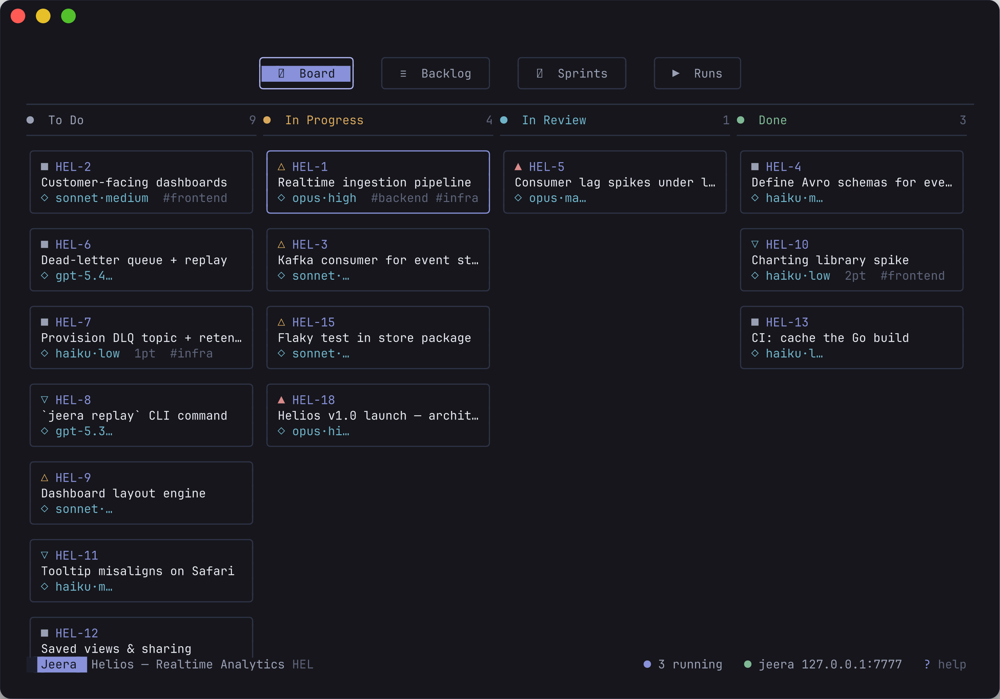
</div>

---

## Why Jeera?

For two decades, shipping software has meant *running the loop*: slice the work into tickets, move cards across a board, ship, repeat. Agile won — and tools like Jira won with it. **Everyone remembers cutting their first ticket.** 🎟️

But the loop has changed shape. In agentic development, **execution is no longer the bottleneck — planning is.** An agent can write the code in minutes; the hard part is deciding *what* to build, slicing it into well-formed work, and keeping the whole picture coherent. The board matters *more* than ever — it just has a new kind of teammate reading from it.

So Jeera flips the model on its head:

- 🤖 **Tickets are assigned to agents, not just colleagues.** A built-in **Model Context Protocol** server lets any agent *list, create, transition, comment on and link* issues. Your agents always know the plan — no scraping, no glue code, no copy-paste.
- ⚡ **A ticket is something you can *run*.** Press **Start** and Jeera spawns a local coding agent (`claude`, `codex`) on the issue — in its own isolated git worktree, pointed back at Jeera's own MCP, so it moves the ticket through *In Progress → Done* as it works.
- 🧩 **It's a CLI, and it respects that.** Written in **Go** as a single, fast, lightweight static binary. **No account. Works fully offline. Lives in your terminal.** Your issues are yours — in a local SQLite file on your machine.

Jeera is **local-first** and the **system of record**: it *owns* your tickets. A human drives the board through a snappy TUI; agents drive the *same* tickets over MCP. Move a card and an agent sees it; let an agent transition an issue and the board updates live. They never drift apart.

---

## How it works

`jeera` starts **two front-ends over one core** in a single process — a Bubble Tea board and an HTTP MCP server — backed by a shared store, an execution engine, and a scheduler that drive your local AI CLIs.

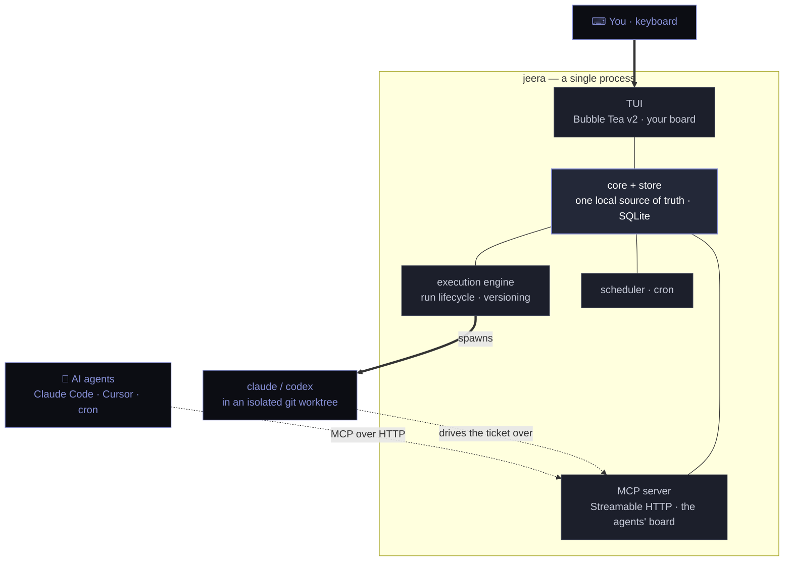

| Command | What it does |
|---|---|
| `jeera` | TUI **and** MCP server (the default) |
| `jeera --headless` | MCP server only — no TUI (great for servers & cron) |
| `jeera --no-mcp` | TUI only — no MCP server |
| `jeera version` | print version and exit |

The TUI's footer always shows the live **MCP wire** — `● jeera 127.0.0.1:7777` when an agent can connect — so the human↔agent link is never a mystery.

---

## A look around

Every shot below is the real TUI over a seeded demo project — **Helios**, a realtime-analytics board with epics, sprints, bugs, links, attachments, scheduled runs and a flagship ticket (`HEL-17`).

### The ticket detail — a focusable "bento" of everything

<div align="center">
  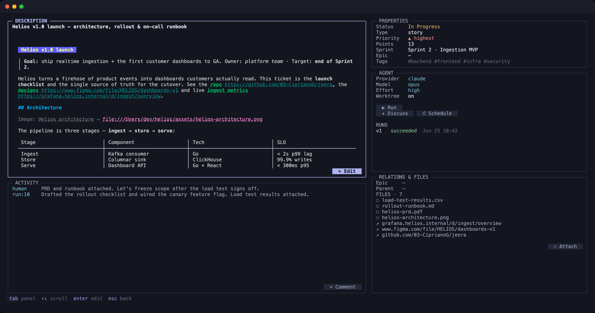
</div>

> `HEL-17` open: rendered Markdown **Description**, a **Properties** panel (status · type · priority · points · sprint · epic · tags), an **Agent** panel (the model assignee, worktree toggle, and **Run / Discuss / Schedule**), **Activity** (human + agent-run comments) and **Relations & Files** (links + attachments). `tab` walks the panels; edits save instantly.

### Runs, Sprints & Backlog

<table>
<tr>
<td width="50%">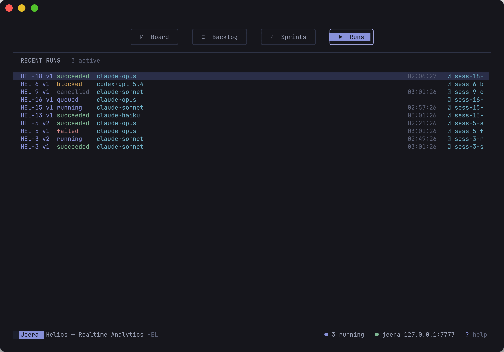</td>
<td width="50%">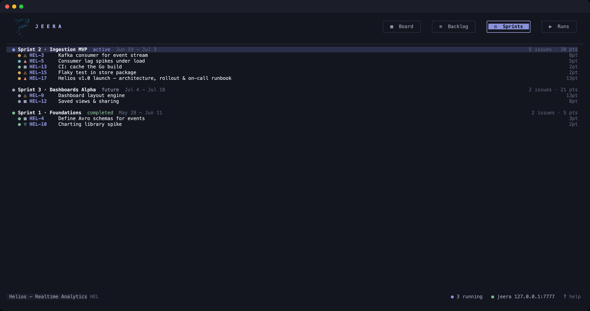</td>
</tr>
<tr>
<td valign="top"><b>Runs</b> — every execution, versioned (<code>v1</code>, <code>v2</code>…), across <i>queued / running / succeeded / failed / cancelled / blocked</i>, with provider·model and resumable sessions.</td>
<td valign="top"><b>Sprints</b> — time-boxed sets ordered <i>active → future → completed</i>, each with its goal, date window, issue count and points.</td>
</tr>
<tr>
<td width="50%">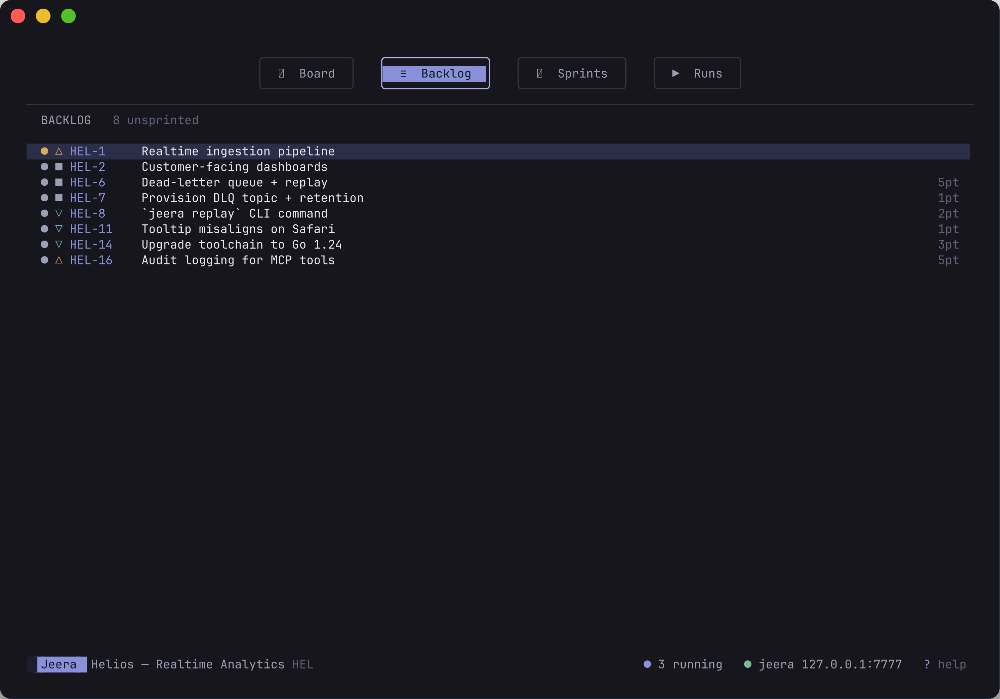</td>
<td width="50%">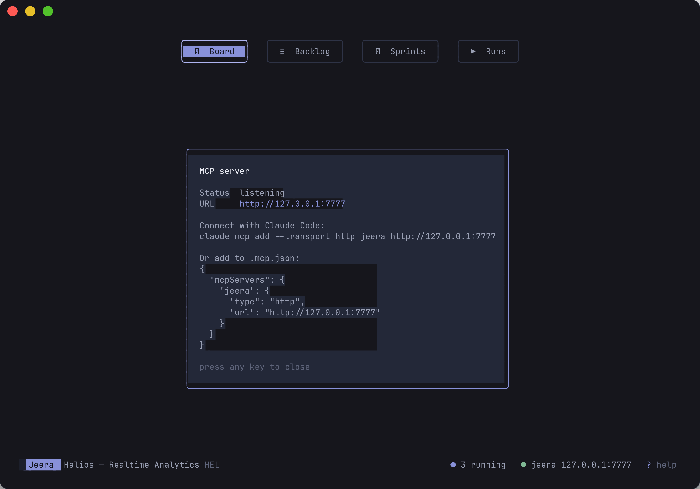</td>
</tr>
<tr>
<td valign="top"><b>Backlog</b> — every unsprinted issue in one keyboard-driven list; <code>a</code> assigns one straight into a sprint.</td>
<td valign="top"><b>MCP overlay</b> (<code>m</code>) — live status, the endpoint URL, and copy-paste snippets to connect Claude Code or an <code>.mcp.json</code> client.</td>
</tr>
</table>

### Find anything — `⌘F` / `/`

<div align="center">
  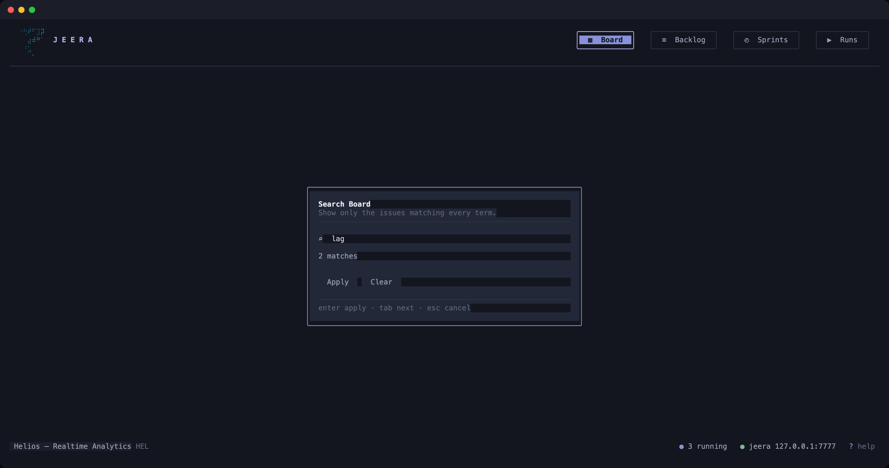
</div>

> Press `⌘F` (or `/`, the universal fallback) on the **Board** or **Backlog** to filter to the issues matching *every* term — by key, title, description, type or assignee — with a live match count as you type. The filter rides through an agent's live edits, and the section heading turns into a filter header with an "N of M" count.

<details>
<summary><b>More views</b> — Settings cascade, Projects, the create-issue form, the Agent panel & the full keymap</summary>
<br/>
<table>
<tr>
<td width="50%">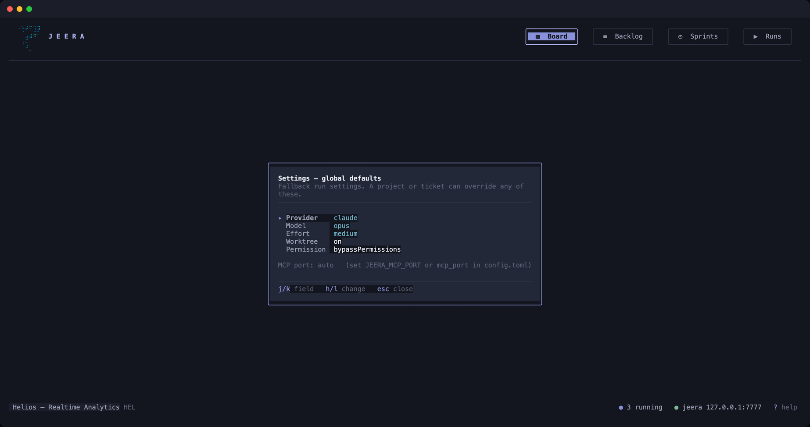</td>
<td width="50%">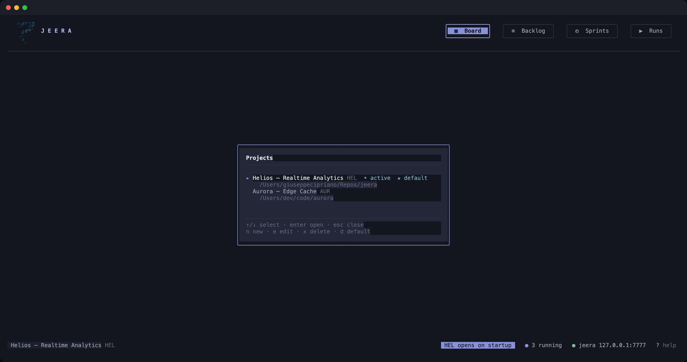</td>
</tr>
<tr>
<td valign="top"><b>Settings</b> (<code>,</code>) — the global run defaults a project or ticket can override.</td>
<td valign="top"><b>Projects</b> (<code>p</code>) — switch between boards, <b>edit</b> or <b>delete</b> them, and <b>pin a default</b> (★) that opens on startup; each is bound to a git repo.</td>
</tr>
<tr>
<td width="50%">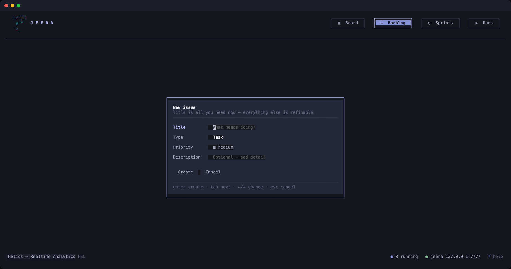</td>
<td width="50%">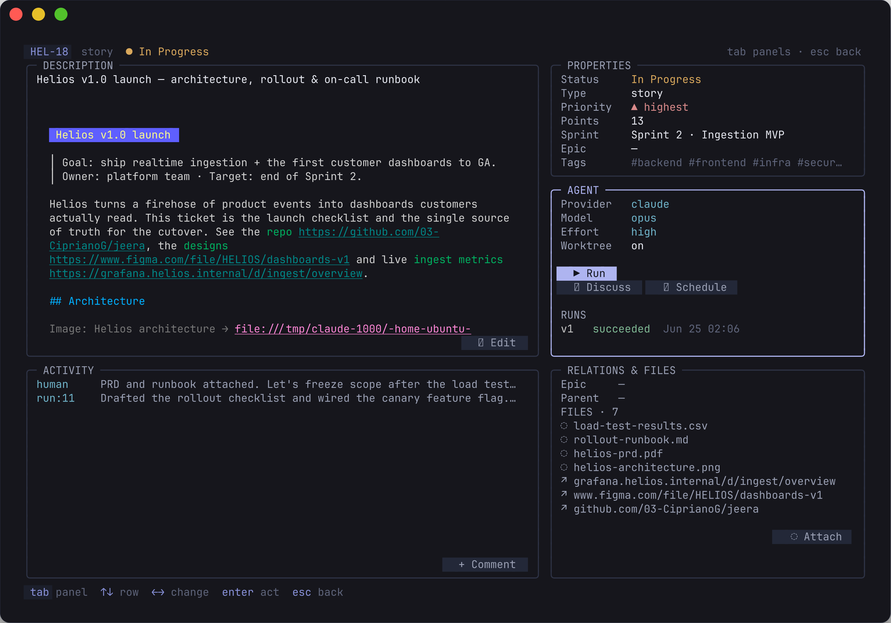</td>
</tr>
<tr>
<td valign="top"><b>Create issue</b> — type, priority, points, sprint & epic in one modal.</td>
<td valign="top"><b>Agent panel</b> focused — pick the model & effort, toggle the worktree, then <b>Run</b>, <b>Discuss</b> or <b>Schedule</b>.</td>
</tr>
</table>
<div align="center">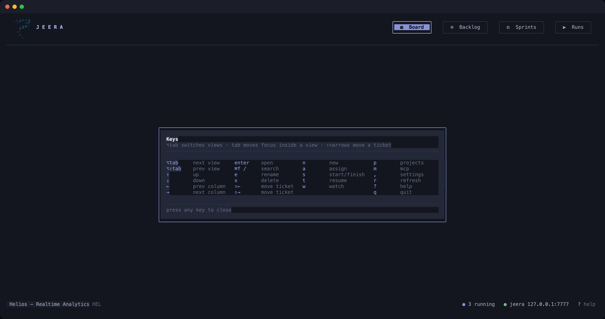</div>
<div align="center"><sub>The full keymap (<code>?</code>) — <code>⌥tab</code> switches views, <code>tab</code> moves focus inside a view, <code>⇧+arrows</code> move a ticket.</sub></div>
</details>

---

## Features

> Legend: ✅ available today · 🔭 on the roadmap

<details open>
<summary><b>📋 The board & issues</b></summary>
<br/>

| Feature | | Notes |
|---|:--:|---|
| **Projects** bound to a git repo | ✅ | Each owns a key prefix (`HEL-17`) and a repo; switch, **edit**, **delete**, and pin a **default** that opens on startup |
| **Issues** — epics · stories · tasks · bugs · subtasks | ✅ | Markdown descriptions, per-project sequential keys |
| **Sprint board** (the active sprint) | ✅ | A SCRUM board: the **active sprint's** issues across *To Do / In Progress / In Review / Done* lanes; move cards with `⇧+arrows`; tall lanes scroll. With no active sprint it prompts you to start one |
| **Ticket detail "bento"** | ✅ | Markdown edit/preview + in-place editing of status, type, priority, points, sprint, epic, tags & assignee |
| **In-view search** | ✅ | `⌘F` / `/` filters the Board or Backlog to issues matching *every* term — key, title, description, type or assignee |
| **Backlog** view | ✅ | Every unsprinted issue in one list; assign straight to a sprint |
| **Sprints** | ✅ | Time-boxed, *future / active / completed*, goals & date windows, backlog ↔ sprint |
| **Priority · story points · tags** | ✅ | Five priority levels, point estimates, project-scoped colored labels |
| **Relationships** | ✅ | *blocks · blocked-by · relates · duplicates*, shown from both sides |
| **Comments & activity** | ✅ | Humans **and** agent runs post to the same timeline |
| **Attachments** | ✅ | URLs & file refs pinned to a ticket, opened externally (references, not bytes) |
| **Model assignees** | ✅ | Work is assigned to a *model* — provider + model + reasoning effort, not a person |
| **Live refresh** | ✅ | The board re-renders the instant an agent writes over MCP |
| Dedicated epic board | 🔭 | Epics already work as parents on the ticket; a dedicated screen is on the way |

</details>

<details open>
<summary><b>⚡ Agentic execution</b></summary>
<br/>

| Feature | | Notes |
|---|:--:|---|
| **Embedded MCP server** | ✅ | Streamable HTTP, started with `jeera` / `--headless`; **16 typed tools** for agents |
| **Start a ticket** | ✅ | Spawn `claude`/`codex` on the issue; it drives the ticket over MCP, streamed into **Runs** |
| **Run versioning** | ✅ | Every Start is a new, recorded run version (provider · model · effort · session · status · lineage) |
| **Per-ticket git worktrees** | ✅ | Each run is isolated on its own branch (default on, toggle per ticket) |
| **Model + effort picker** | ✅ | Choose provider, model and reasoning effort per ticket from the detail view |
| **Schedule Start** | ✅ | Enter a cron spec; Jeera runs the ticket on time — persisted across restarts & headless |
| **Start with children** | ✅ | Run sub-issues in dependency order, then the parent |
| **Discuss / Expand** | ✅ | Drop into an interactive agent session pre-loaded with the ticket — in a new terminal, never inline |
| **Resume & Watch** | ✅ | Re-open a past run's session, or tail a live run's log, from the Runs view |
| **Terminal-or-copy launch** | ✅ | Sessions open in tmux/zellij or a GUI terminal; over SSH with none, the command is copied to your clipboard |

</details>

<details open>
<summary><b>🧩 Config, data & integration</b></summary>
<br/>

| Feature | | Notes |
|---|:--:|---|
| **Settings cascade** | ✅ | Resolve every run **issue → project → global**; edit global defaults live with `,` |
| **Pluggable providers** | ✅ | `claude` and `codex` drivers — it drives the CLIs you already have, no API keys or SDKs |
| **Local-first SQLite store** | ✅ | The system of record, on your machine; honors `XDG_*` and `JEERA_DATA_DIR` |
| **Always-on MCP "wire"** | ✅ | The footer shows the live endpoint agents connect to |
| **Single static binary** | ✅ | CGO-free Go; trivial cross-compilation, nothing to install but the binary |

</details>

---

## Agent tools (MCP)

Point any MCP client at the server (the TUI shows the live URL) and it gets **19 typed tools** over Streamable HTTP at `http://127.0.0.1:7777`. Agents address everything by human-readable identifiers — issues by `key` (`HEL-17`), projects by `key_prefix`, and statuses / sprints / epics / tags by **name**. Internal numeric IDs are never exposed.

| Tool | Category | Purpose |
|---|---|---|
| `list_projects` | Projects | List all projects |
| `get_project` | Projects | Get a project and its board columns by key prefix |
| `create_project` | Projects | Create a board with a key prefix, bound to a git repo |
| `list_issues` | Issues | List issues, filtered by status / sprint / epic / type / text |
| `get_issue` | Issues | Get one issue by key, with its links & comments |
| `create_issue` | Issues | Create an issue in a project |
| `update_issue` | Issues | Partially update an issue's fields |
| `transition_issue` | Issues | Move an issue to another status/column by name |
| `set_assignee` | Issues | Assign an issue to a model (provider · model · effort) |
| `add_comment` | Collaboration | Add a comment to an issue's timeline |
| `link_issues` | Relationships | Relate two issues (blocks / blocked_by / relates / duplicates) |
| `add_attachment` | Attachments | Attach a URL or file-path reference to an issue |
| `list_sprints` | Sprints | List a project's sprints |
| `create_sprint` | Sprints | Plan a future sprint in a project |
| `start_sprint` | Sprints | Start a sprint — make it the project's one active sprint |
| `complete_sprint` | Sprints | Finish a sprint; unfinished issues roll back to the backlog |
| `add_to_sprint` | Sprints | Add an issue to a sprint (or return it to the backlog) |
| `list_tags` | Tags | List a project's tags |
| `tag_issue` | Tags | Add a tag to an issue, creating it if needed |

<details>
<summary><b>Full tool reference</b> — arguments & return shapes for all 19 tools</summary>
<br/>

Optional arguments are marked `?`. Most tools return an **Issue** object (`key`, `title`, `type`, `status`, `priority`, `story_points?`, `assignee?`, `epic_key?`, `sprint?`, `tags?`, `description?`, timestamps).

**Projects**

| Tool | Arguments | Returns |
|---|---|---|
| `list_projects` | _(none)_ | `{ projects: Project[] }` |
| `get_project` | `project` | `Project` + board `statuses` |
| `create_project` | `name`, `key_prefix`, `repo_path?` | `Project` + `statuses` |

**Issues**

| Tool | Arguments | Returns |
|---|---|---|
| `list_issues` | `project`, `status?`, `sprint?`, `epic?`, `type?`, `text?` | `{ issues: Issue[] }` |
| `get_issue` | `key` | `Issue` + `links[]` + `comments[]` |
| `create_issue` | `project`, `title`, `type?`, `description?`, `priority?`, `story_points?`, `status?`, `epic?`, `sprint?` | `Issue` |
| `update_issue` | `key`, `title?`, `description?`, `priority?`, `type?`, `story_points?` | `Issue` |
| `transition_issue` | `key`, `status` | `Issue` |
| `set_assignee` | `key`, `provider`, `model`, `effort?` | `Issue` |

**Collaboration · Relationships · Attachments**

| Tool | Arguments | Returns |
|---|---|---|
| `add_comment` | `key`, `body`, `author?` | `{ comment }` |
| `link_issues` | `source`, `target`, `type` | `{ ok, source, target, type }` |
| `add_attachment` | `key`, `ref` _(URL or file path)_ | `{ attachment }` |

**Sprints · Tags**

| Tool | Arguments | Returns |
|---|---|---|
| `list_sprints` | `project` | `{ sprints: Sprint[] }` |
| `create_sprint` | `project`, `name`, `goal?` | `Sprint` _(future)_ |
| `start_sprint` | `project`, `sprint` | `Sprint` _(now active; one active per project)_ |
| `complete_sprint` | `project`, `sprint` | `Sprint` _(completed; unfinished issues → backlog)_ |
| `add_to_sprint` | `key`, `sprint?` _(empty → backlog)_ | `Issue` |
| `list_tags` | `project` | `{ tags: Tag[] }` |
| `tag_issue` | `key`, `tag` | `Issue` |

**Enums** — `type`: `epic · story · task · bug · subtask` · `priority`: `lowest · low · medium · high · highest` · `provider`: `claude · codex` · `effort`: `low · medium · high · xhigh · max` · `link type`: `blocks · blocked_by · relates · duplicates`.

</details>

---

## Keybindings

Jeera is keyboard-first. `⌥tab` switches the four top-level views; `tab` moves focus *inside* a view; `⇧+arrows` move a ticket across columns. Press `?` any time for the full map.

<details>
<summary><b>The full keymap</b></summary>
<br/>

**Global** (work from every view)

| Key | Action | | Key | Action |
|---|---|---|---|---|
| `⌥tab` / `⌥⇧tab` | next / prev view | | `p` | projects |
| `↑↓←→` / `hjkl` | move cursor | | `m` | MCP server info |
| `enter` | open / confirm | | `,` | settings |
| `n` | new (by context) | | `r` | refresh |
| `?` | help | | `q` / `ctrl+c` | quit |

**Board**

| Key | Action |
|---|---|
| `⇧←` / `⇧→` (`H` / `L`) | move ticket to the adjacent column |
| `e` · `x` | rename · delete the selected issue |
| `⌘F` / `/` | search — filter the board to matching issues (`esc` clears) |
| `enter` | open ticket detail (or the `+ New issue` slot) |

**Backlog & Sprints**

| Key | Action |
|---|---|
| `a` | assign issue to a sprint (Backlog) · add/move issue (Sprints) |
| `s` | advance a sprint's state — *future → active → completed* |
| `⌫` | pull a sprinted issue back to the backlog |
| `⌘F` / `/` | search the backlog |
| `n` · `x` | new sprint · delete sprint |

**Projects** (the `p` overlay)

| Key | Action |
|---|---|
| `n` · `e` · `x` | new · edit · delete the selected project |
| `d` | pin as the **default** that opens on startup |
| `enter` | switch to the selected project |

**Runs**

| Key | Action |
|---|---|
| `t` / `enter` | resume the selected run's session in a terminal |
| `w` | watch (tail) the selected run's live log |

**Ticket detail (bento)**

| Key | Action |
|---|---|
| `tab` / `⇧tab` | focus next / previous panel |
| `←/→` (`h`/`l`) | cycle the focused field's value |
| `enter` | edit the field · run a panel button (Run / Discuss / Schedule, Attach, Comment) |
| `e` | edit the Markdown description (`ctrl+s` to save) |
| `o` | open the selected attachment externally |
| `esc` / `q` | back to the board |

</details>

---

## Install

**Pre-built binaries** — download the archive for your OS/arch from the [latest release](https://github.com/03-CiprianoG/jeera/releases/latest), extract, and put `jeera` on your `PATH`.

**`go install`** (Go 1.26+):

```sh
go install github.com/03-CiprianoG/jeera@latest
```

**From source:**

```sh
git clone https://github.com/03-CiprianoG/jeera.git
cd jeera
go build -o jeera .     # single static binary (CGO-free)
./jeera version
```

Jeera stores data under your XDG data dir (`~/.local/share/jeera/jeera.db`) and reads config from `~/.config/jeera/`. Both honor `XDG_*` and the `JEERA_DATA_DIR` / `JEERA_CONFIG_DIR` overrides.

---

## Connecting an agent

With the server running (its URL is shown in the TUI footer and the `m` overlay), point your client at it. For **Claude Code**:

```sh
claude mcp add --transport http jeera http://127.0.0.1:7777
```

…or drop this into `.mcp.json`:

```json
{
  "mcpServers": {
    "jeera": { "type": "http", "url": "http://127.0.0.1:7777" }
  }
}
```

Now your agent can read and write the same board you're looking at — and you can hit **Start** to let Jeera run an agent on a ticket for you.

---

## Configuration

Every run's settings resolve through a three-layer cascade — **issue → project → global** — so you set sensible defaults once and override only where it matters. Press `,` in the board to edit the global defaults live, or write `~/.config/jeera/config.toml`:

```toml
mcp_port = 7777          # preferred MCP port (JEERA_MCP_PORT still wins)

[defaults]
provider        = "claude"            # claude | codex
model           = "opus"
effort          = "medium"            # low | medium | high | xhigh | max
worktree_on     = true                # isolate each run in a git worktree
permission_mode = "bypassPermissions" # bypassPermissions | acceptEdits | plan | default
```

A project can override any default, and a ticket overrides its project — and a model that doesn't fit the resolved provider falls back to that provider's default, so a run never starts misconfigured.

---

## Built with

Chosen deliberately, every external API verified against current upstream releases.

| Layer | Choice | Why |
|---|---|---|
| Language | **Go 1.26** | Single static binary, trivial cross-compilation, strong concurrency |
| TUI | **Bubble Tea v2** · **Lip Gloss v2** · **Bubbles v2** | The gold standard for clean terminal UIs; v2's cell renderer is built for speed |
| Markdown | **Glamour v2** | Styled rendering of ticket descriptions |
| Agents (server) | **MCP Go SDK** (official) | The same binary serves agents and humans over Streamable HTTP |
| Agents (execution) | **`claude` / `codex` CLIs** | Drives the tools you already have — no API keys, no SDKs |
| Storage | **modernc.org/sqlite** (pure Go) + **goose** | Local-first system of record; keeps the binary static (no CGO) |
| Scheduling | **gocron** | In-process cron for "Schedule Start" |

The interface is one calm design system — *"Slate & Iris"*: a deep blue-slate base, soft parchment text, and a single restrained iris accent reserved for focus and the MCP wire.

---

## Roadmap

Released under [semantic versioning](https://semver.org); each milestone is one or more pull requests. Jeera is **feature-complete and stable** (latest: see the [release badge](https://github.com/03-CiprianoG/jeera/releases/latest)).

- [x] **Foundation** — domain model + local SQLite store
- [x] **MCP server** — 16 typed tools over the shared store
- [x] **Kanban board** — design system + the human's board
- [x] **Ticket detail** — rich-text editing, every field, comments
- [x] **Execution engine** — Start / worktrees / runs / versioning
- [x] **Scheduling** — cron a ticket to run itself, persisted & headless
- [x] **Settings cascade** — global → project → ticket config
- [x] **Agent actions** — Discuss/Expand + Start-with-children
- [x] **Attachments** — links, file refs, external open
- [x] **Backlog & Sprints** views — dedicated management screens
- [ ] **Dedicated epic board**

---

## Contributing

Contributions are very welcome. See **[CONTRIBUTING.md](CONTRIBUTING.md)**. In short: `main` is protected, so all changes land via pull request (base `dev`), must pass CI, and follow [Conventional Commits](https://www.conventionalcommits.org). See **[CHANGELOG.md](CHANGELOG.md)** for what's shipped. By participating you agree to our [Code of Conduct](CODE_OF_CONDUCT.md).

## License

[MIT](LICENSE) © 2026 Giuseppe Cipriano and the Jeera contributors.

## Acknowledgements

Standing on the shoulders of [Charm](https://charm.sh) (Bubble Tea, Lip Gloss & Glamour), the [Model Context Protocol](https://modelcontextprotocol.io), and [lazygit](https://github.com/jesseduffield/lazygit) for the inspiration.

---

## Star history

<div align="center">
<a href="https://star-history.com/#03-CiprianoG/jeera&Date">
  <picture>
    <source media="(prefers-color-scheme: dark)" srcset="https://api.star-history.com/svg?repos=03-CiprianoG/jeera&type=Date&theme=dark" />
    <source media="(prefers-color-scheme: light)" srcset="https://api.star-history.com/svg?repos=03-CiprianoG/jeera&type=Date" />
    
  </picture>
</a>
</div>

<div align="center"><sub>Built in the open with <a href="https://claude.com/claude-code">Claude Code</a>. If Jeera saves you a copy-paste, leave a ⭐.</sub></div>
